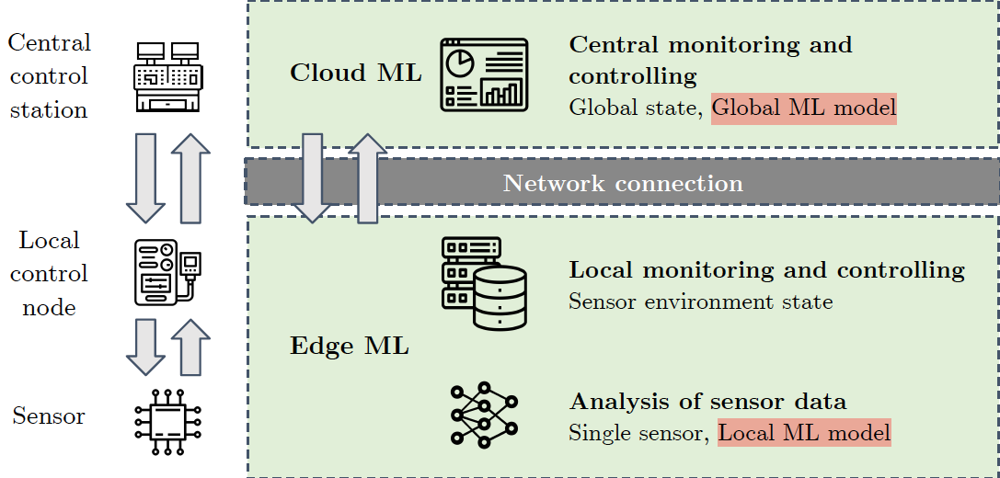
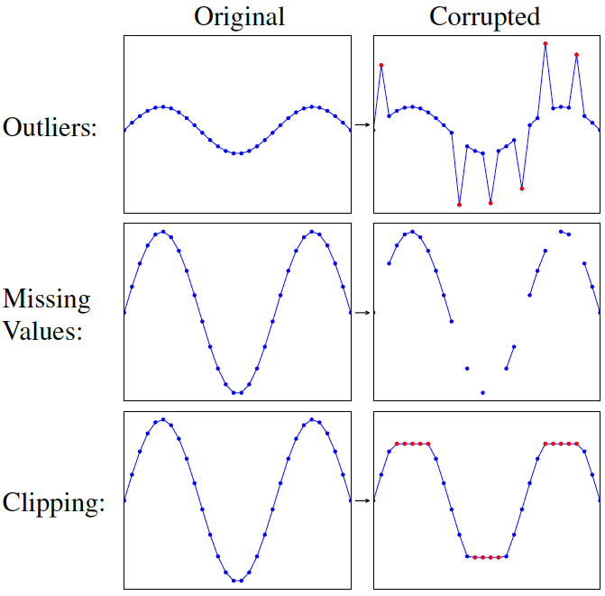

# Evaluating Time Series Models for Urban Wastewater Management: Predictive Performance, Model Complexity and Resilience
Presented at the 10th International Conference on Smart and Sustainable Technologies (SpliTech 2025)

**Authors**: Vipin Singh, Tianheng Ling, Teodor Chiaburu, Felix Biessmann

---

## Table of Contents

* [Abstract](#abstract)
* [Project Overview](#project-overview)
* [Installation](#installation)
* [Dataset](#dataset)
* [Usage](#usage)
    * [Training](#training)
    * [Evaluation](#evaluation)
* [Results](#results)
* [Repository Structure](#repository-structure)

---

## Abstract

Climate change increases the frequency of extreme rainfall, placing a significant strain on urban infrastructures, especially Combined Sewer Systems (CSS). Overflows from overburdened CSS release untreated wastewater into surface waters, posing environmental and public health risks. Although traditional physics-based models are effective, they are costly to maintain and difficult to adapt to evolving system dynamics. Machine Learning (ML) approaches offer cost-efficient alternatives with greater adaptability. To systematically assess the potential of ML for modeling urban infrastructure systems, we propose a protocol for evaluating Neural Network architectures for CSS time series forecasting with respect to predictive performance, model complexity, and robustness to perturbations. In addition, we assess model performance on peak events and critical fluctuations, as these are the key regimes for urban wastewater management. To investigate the feasibility of lightweight models suitable for IoT deployment, we compare global models, which have access to all information, with local models, which rely solely on nearby sensor readings. Additionally, to explore the security risks posed by network outages or adversarial attacks on urban infrastructure, we introduce error models that assess the resilience of models.

Our results demonstrate that while global models achieve higher predictive performance, local models provide sufficient resilience in decentralized scenarios, ensuring robust modeling of urban infrastructure. Furthermore, models with longer native forecast horizons exhibit greater robustness to data perturbations. These findings contribute to the development of interpretable and reliable ML solutions for sustainable urban wastewater management.

## Project Overview

- Comparison of 6 Neural Network architectures for time series forecasting
- Establishing global and local models for resliency against network outages:

    - Global models: Access to all sensor data
    - Local models: Only use nearby sensor readings
- Robustness analysis of models against realistic errors:

    - Outliers: e. g. sensor miscalibration
    - Missing Values: e. g. mainetenance or network outages
    - Clipping: e. g. physical limitations of sensors
- Evaluation of model performance on peak events and critical fluctuations
- Holistic evaluation of model performance, complexity, and resilience

## Installation

1.  **Clone the repository:**
    ```bash
    git clone ...
    ```

2.  **Create a virtual environment (recommended):**
    ```bash
    # Using venv
    python -m venv env
    source env/bin/activate # On Windows use `env\Scripts\activate`
    ```

3.  **Install dependencies:**
    ```bash
    # Using pip
    pip install -r requirements.txt
    ```
    *Note: The key dependency for running the models is PyTorch with version 2.2.2.*

## Dataset

For carrying out the experiments and training our models we disposed of a real-world dataset of a Combined Sewer System in the city of Duisburg, Germany, provided by the *Wirtschaftsbetriebe Duisburg* (WBD).

**The full dataset cannot be made publicly available, because of information on critical infrastructure.**

For further details on the dataset, please refer to the paper.

## Usage

The code can be used through running the `main.py` script, which allows for training and inference of time series models.

To see all available command line arguments, run:
```bash
python main.py --help
```

**TODO**

## Results

**TODO**

## Repository Structure

The repository is structured as follows (*only relevant files displayed*):

* [`main.py`](./main.py): The main script and entry point for running experiments.
* [`requirements.txt`](./requirements.txt): Lists the Python packages required to run the code.
* [`README.md`](./README.md): Provides an overview of the project, setup instructions, and how to run the experiments.
* [`data/`](./data/): Contains scripts for data loading, processing, and exploratory data analysis (EDA).
    * [`TimeSeriesDatasetCreator.py`](./data/TimeSeriesDatasetCreator.py): Creates the time series dataset for the experiments.
    * [`VierlindenDataProcessor.py`](./data/VierlindenDataProcessor.py): Processes the specific "Vierlinden" dataset.
    * [`eda/`](./data/eda/): Holds notebooks and reports from the exploratory data analysis phase.
* [`models/`](./models/): Includes modules for building and loading the forecasting models.
    * [`build_model.py`](./models/build_model.py): Constructs the different time-series models (e.g., DeepAR, LSTM, TCN).
    * [`load_model.py`](./models/load_model.py): Loads pre-trained models for evaluation or inference.
* [`utils/`](./utils/): A collection of helper scripts for the core logic of the experiments.
    * [`ErrorGeneration.py`](./utils/ErrorGeneration.py): Generates different types of errors (e.g., outliers, missing values) to test model resilience.
    * [`ExperimentRunner.py`](./utils/ExperimentRunner.py): Manages the execution of the entire experimental workflow.
    * [`HyperparameterOptimizer.py`](./utils/HyperparameterOptimizer.py): Handles the hyperparameter optimization (HPO) process.
    * [`ModelTrainer.py`](./utils/ModelTrainer.py): Contains the logic for training the models.
    * [`ModelEvaluator.py`](./utils/ModelEvaluator.py): Evaluates model performance using various metrics.
* [`args_files/`](./args_files/): Stores configuration and argument files for different experimental setups.
    * [`best_hp/`](./args_files/best_hp/): Contains the best hyperparameter configurations found for each model, separated by `global` and `local` scenarios.
    * [`hpo_args_files/`](./args_files/hpo_args_files/): Arguments for running hyperparameter optimization sweeps.
    * [`errorgen_exp/`](./args_files/errorgen_exp/): Scripts and arguments for running the error generation experiments.
* [`hpo_configs/`](./hpo_configs/): YAML configuration files for the hyperparameter optimization sweeps for each model.
* [`archives/`](./archives/): Contains notebooks and detailed analyses from various experimental stages.
    * [`errorgen_analysis/`](./archives/errorgen_analysis/): In-depth analysis of the error generation experiments, including plots and explanations of different error types.
    * [`wandb_visualizations/`](./archives/wandb_visualizations/): Notebooks and results related to visualizing experiment data.